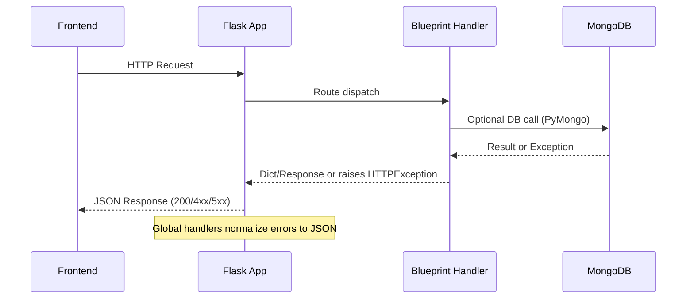

# BackendAPIService — Comprehensive Backend Report

## Overview

BackendAPIService is a Flask-based REST API for managing network devices. It provides CRUD operations, a safe reachability check (ping), and health endpoints. MongoDB is used for persistence via PyMongo with lazy initialization, and API schema and validation are handled by flask-smorest and marshmallow. CORS is centrally configured to allow secure cross-origin calls from the React frontend.

This report documents the current architecture, endpoints, request/response schemas, data validation, MongoDB integration, environment variables, setup instructions, error handling, observability, performance considerations, and planned improvements. All details are derived from the code and generated OpenAPI spec to ensure accuracy.

## Architecture

### High-level components

- Flask application bootstrap and configuration:
  - app/__init__.py configures Flask, CORS, API documentation (flask-smorest), and global error handling. Blueprints are registered for health and device routes. Environment variables from .env are auto-loaded via python-dotenv if present.
- Routing and controllers:
  - app/routes/health.py provides root and health endpoints including DB health and a diagnostic devices summary.
  - app/routes/devices.py exposes CRUD endpoints and a safe ping action for devices. Responses are consistently JSON with explicit content-type.
- Validation and serialization:
  - app/schemas.py contains marshmallow schemas for device input/output and list responses, including custom IPv4 validation and ObjectId/timestamp normalization.
- Database access:
  - app/db.py implements lazy MongoDB client initialization, environment-variable driven configuration, masking of sensitive URI parts for logs, index management, and health ping helpers.
- Entrypoint:
  - run.py starts the Flask development server on 0.0.0.0 using PORT environment variable (default 3001).
- OpenAPI generation:
  - generate_openapi.py exports the in-memory OpenAPI spec to interfaces/openapi.json after app context init.

### Request handling and error policy

- Validation errors from marshmallow/webargs are normalized to HTTP 400 with a standard JSON envelope by handlers in app/__init__.py.
- All HTTP errors raised as HTTPException are transformed into consistent JSON payloads.
- Unexpected exceptions return a 500 JSON payload without leaking internals, logging minimally to stdout.
- Devices endpoints additionally catch exceptions and return explicit JSON error responses to ensure Content-Type integrity in failure modes.

### CORS configuration

- Configured globally via flask-cors in app/__init__.py with:
  - Allowed methods: GET, POST, PUT, PATCH, DELETE, OPTIONS
  - Allowed headers: Content-Type, Authorization, X-Requested-With
  - Exposed headers: Content-Type, Content-Length, X-Request-Id
  - Origins resolved from environment variables (BACKEND_CORS_ORIGINS, FRONTEND_ORIGIN, FRONTEND_ORIGIN_ALLOWLIST/CORS_ALLOWED_ORIGINS) with default http://localhost:3000.
  - Credentials support toggled by CORS_SUPPORTS_CREDENTIALS (default false).

## REST API Endpoints

All routes are registered using flask-smorest blueprints and surfaced in the OpenAPI spec. Below summaries cover behavior and example payloads.

### Health

- GET /
  - Summary: Basic service liveness.
  - Response: 200 {"message":"Healthy"}

- GET /health
  - Summary: Composite health with DB status.
  - Response: 200
    - {"status":"ok","db_status":"ok"} when DB reachable
    - {"status":"ok","db_status":"unconfigured","db_message":"..."} if not configured
    - {"status":"ok","db_status":"error","db_message":"..."} when configured but failing

- GET /health/db
  - Summary: Database health and minimal server info.
  - Response: 200
    - {"status":"ok","db_status":"ok","server":{"ok":1.0}} on success
    - {"status":"ok","db_status":"unconfigured","message":"..."} if not configured
    - {"status":"ok","db_status":"error","message":"..."} when configured but failing

- GET /health/devices-summary
  - Summary: Diagnostics showing active DB name, resolved collection, document count, and up to 3 sample IDs.
  - Response: 200 {"dbName":"<db>","collection":"<collection>","count":<int>,"sampleIds":["id1","id2","id3"]}

### Devices

- OPTIONS /devices and /devices/{id}/ping
  - Summary: Preflight support for CORS.
  - Response: 204 (typical)

- GET /devices
  - Summary: List devices with pagination envelope.
  - Query params: page (default 1, 1-based), limit (default 10, range 1..1000)
  - Response: 200 {"items":[...],"total":<int>,"page":<int>,"limit":<int>}
  - On invalid pagination: 400 Validation payload.

- POST /devices
  - Summary: Create a device.
  - Request body (application/json):
    - name: string (required)
    - ip_address: IPv4 string (required, unique)
    - type: string enum ["router","switch","server"] (required)
    - location: string (required)
    - status: string enum ["online","offline","unknown"] (required)
  - Response: 201 DeviceOut
  - On duplicate ip_address: 409 {"error":{"field":"ip_address","message":"already exists"}}
  - On validation error: 400 standardized validation payload.

- GET /devices/{id}
  - Summary: Retrieve a device by ID.
  - Response: 200 DeviceOut, or 404 if not found.

- PUT /devices/{id}
  - Summary: Update device fields (all optional; same validation rules apply).
  - Request body: Any subset of fields in DeviceUpdate
  - Response: 200 DeviceOut, or 404 if not found
  - On duplicate ip_address: 400 with error details.

- DELETE /devices/{id}
  - Summary: Delete a device by ID.
  - Response: 204 on success, 404 if not found.

- POST /devices/{id}/ping
  - Summary: Safe reachability check. Attempts DNS resolve and short TCP connects to 80/443. Updates status ("online"/"offline") and last_checked.
  - Response: 200 DeviceOut after update, or 404 if not found.

### Example requests

- Create device:
  ```
  POST /devices
  Content-Type: application/json

  {
    "name": "Core Router",
    "ip_address": "192.168.0.1",
    "type": "router",
    "location": "DC-1",
    "status": "online"
  }
  ```

- List devices page 1:
  ```
  GET /devices?page=1&limit=10
  ```

- Update name:
  ```
  PUT /devices/<id>
  Content-Type: application/json

  { "name": "Core Router v2" }
  ```

- Ping device:
  ```
  POST /devices/<id>/ping
  ```

## Request/Response Schemas

Defined in app/schemas.py and exposed in interfaces/openapi.json.

- DeviceCreate (request):
  - name: string minLength 1
  - ip_address: string, validated IPv4
  - type: enum ["router","switch","server"]
  - location: string minLength 1
  - status: enum ["online","offline","unknown"]
  - required: all above fields

- DeviceUpdate (request):
  - All above fields optional with the same constraints.

- DeviceOut (response):
  - id: string (MongoDB ObjectId string)
  - name, ip_address, type, location, status: strings with allowed enums where applicable
  - last_checked: ISO8601 timestamp or null
  - created_at: ISO8601 timestamp
  - updated_at: ISO8601 timestamp

- DeviceListOut (response):
  - items: array of DeviceOut
  - total: integer
  - page: integer
  - limit: integer

## Data Validation and Constraints

- IPv4 validation: Custom _ipv4_validator ensures four octets 0–255 and numeric content.
- Field presence: name, ip_address, type, location, status are required for creation.
- Enumerations:
  - type: router | switch | server
  - status: online | offline | unknown
- Uniqueness: MongoDB unique index on ip_address ensures one device per IP. Enforced at DB level with DuplicateKeyError handling:
  - POST duplicates: HTTP 409
  - PUT duplicates: HTTP 400 with field error
- Update semantics: PUT requires at least one field; empty payload results in HTTP 400.

## MongoDB Integration

### Connection strategy

- Lazy initialization on first DB access; startup does not require a configured MongoDB.
- Preferred single variable: MONGODB_URI (supports mongodb:// and mongodb+srv://).
- Fallback individual parts if URI is absent: MONGODB_HOST, MONGODB_PORT, MONGODB_USERNAME, MONGODB_PASSWORD, MONGODB_OPTIONS.
- DB selection:
  - Default DB: "network" (can be overridden using MONGODB_DB_NAME).
  - If MONGODB_URI includes a path segment, that DB is used unless MONGODB_DB_NAME is set.
- TLS support: Enabled via MONGODB_TLS=true.
- Server selection timeout: MONGODB_CONNECT_TIMEOUT_MS (default 5000 ms).
- Health ping:
  - app/db.py.ping() attempts connection and returns (ok, error_message_or_none). Error messages include masked target info and hints.

### Collections and indexes

- Devices collection: Name resolved by MONGODB_COLLECTION (default "device").
- Indexes (created in background on initial connect):
  - Unique on ip_address (name: uniq_ip)
  - Non-unique on type (name: idx_type)
  - Non-unique on status (name: idx_status)

### Entity shape

- Device document fields:
  - _id: ObjectId
  - name: string
  - ip_address: string (unique)
  - type: string enum
  - location: string
  - status: string enum
  - created_at: datetime (UTC)
  - updated_at: datetime (UTC)
  - last_checked: datetime or null

## Environment Variables and Configuration

Backend variables:
- PORT: Application port (default 3001).
- CORS configuration:
  - BACKEND_CORS_ORIGINS: Comma-separated list of allowed origins.
  - FRONTEND_ORIGIN: Single allowed origin.
  - FRONTEND_ORIGIN_ALLOWLIST or CORS_ALLOWED_ORIGINS: Legacy allowlist (comma-separated).
  - CORS_SUPPORTS_CREDENTIALS: "true" to enable credentials; default false.
- MongoDB:
  - MONGODB_URI: Preferred single-URI.
  - MONGODB_DB_NAME: Database name override (default "network").
  - MONGODB_COLLECTION: Devices collection (default "device").
  - MONGODB_TLS: Enable TLS if "true".
  - MONGODB_CONNECT_TIMEOUT_MS: Default 5000.
  - Fallbacks when URI absent: MONGODB_HOST (default localhost), MONGODB_PORT (default 27017), MONGODB_USERNAME, MONGODB_PASSWORD, MONGODB_OPTIONS (query string without leading "?").

Frontend-style variable bridging:
- If direct backend variables are not set but REACT_APP_* variants are present, the backend maps them at process start:
  - REACT_APP_MONGODB_URI → MONGODB_URI
  - REACT_APP_MONGODB_DB_NAME → MONGODB_DB_NAME
  - REACT_APP_MONGODB_USERNAME → MONGODB_USERNAME
  - REACT_APP_MONGODB_PASSWORD → MONGODB_PASSWORD
  - REACT_APP_MONGODB_OPTIONS → MONGODB_OPTIONS

Note: The project-wide list provided for this container includes variables such as REACT_APP_API_BASE, REACT_APP_BACKEND_URL, REACT_APP_FRONTEND_URL, REACT_APP_WS_URL, REACT_APP_NODE_ENV, REACT_APP_NEXT_TELEMETRY_DISABLED, REACT_APP_ENABLE_SOURCE_MAPS, REACT_APP_PORT, REACT_APP_TRUST_PROXY, REACT_APP_LOG_LEVEL, REACT_APP_HEALTHCHECK_PATH, REACT_APP_FEATURE_FLAGS, REACT_APP_EXPERIMENTS_ENABLED. These are not consumed by BackendAPIService code paths; they may apply to other containers/environments. Only the REACT_APP_MONGODB_* variables are bridged as described above.

## Setup and Run Instructions

Prerequisites:
- Python 3.10+
- A reachable MongoDB instance (MongoDB Atlas supported) if database-backed endpoints are required.

Steps:
1) Install dependencies:
   - cd BackendAPIService
   - pip install -r requirements.txt

2) Configure environment:
   - Create .env (optionally from a template) and set MONGODB_URI or fallback parts if you need DB access.
   - Configure CORS allowed origins:
     - Preferred: BACKEND_CORS_ORIGINS="http://localhost:3000"
     - Or FRONTEND_ORIGIN="http://localhost:3000"
     - For credentials, set CORS_SUPPORTS_CREDENTIALS=true and ensure frontend requests include credentials.
   - PORT can be set to override default 3001.

3) Start the server:
   - python run.py
   - App listens on http://0.0.0.0:${PORT:-3001}

4) Explore API and docs:
   - API base: http://localhost:3001
   - Swagger UI: http://localhost:3001/docs
   - OpenAPI JSON: http://localhost:3001/openapi.json

5) Generate OpenAPI artifact (optional):
   - python BackendAPIService/generate_openapi.py
   - Output is written to BackendAPIService/interfaces/openapi.json

6) Run tests:
   - pytest
   - Reports:
     - JUnit: BackendAPIService/reports/junit/backend.xml
     - HTML: BackendAPIService/reports/html/backend/index.html

## Error Handling Strategy

- ValidationError and UnprocessableEntity (422) are normalized to HTTP 400 with:
  - {"status":"Bad Request","code":400,"message":"Validation failed","errors":{...},"path":"<path>"}
- HTTPException is transformed into JSON with name-based status and code fields.
- Unexpected exceptions return 500 with a generic message and path; server logs a concise line with the URL path.
- Devices routes wrap database and runtime errors into JSON responses with Content-Type "application/json; charset=utf-8" to ensure frontend fetch() consumers can always parse JSON error bodies.
- DuplicateKeyError from MongoDB uniqueness violations:
  - POST /devices → 409 with {"error":{"field":"ip_address","message":"already exists"}}
  - PUT /devices → translated to HTTP 400 via abort with an error field payload.

## Validation Rules and Constraints

- Creation requires all fields: name, ip_address, type, location, status.
- Update allows any subset; empty payload yields 400.
- IP address must be a valid IPv4 string (custom validator).
- type ∈ {"router","switch","server"}.
- status ∈ {"online","offline","unknown"}.
- ip_address uniqueness is enforced at the collection level via a unique index (uniq_ip).

## Security Considerations

Current omissions and notes:
- No authentication or authorization is implemented. All endpoints are publicly accessible if the service is exposed.
- No API keys or OAuth; all clients can read/write without restriction.
- CORS must be configured to restrict origins in production; avoid "*" unless for limited development scenarios.
- Error payloads avoid including sensitive stack traces. MongoDB target information in health messages is masked to avoid credential leakage.
- TLS to MongoDB can be enabled via MONGODB_TLS. Transport security for the API (HTTPS) should be provided by the deployment platform (proxy/ingress) since the development server is HTTP.

Recommendations:
- Introduce authentication/authorization (e.g., JWT) and role-based access for write operations.
- Rate limit mutating endpoints.
- Validate and sanitize user inputs further if fields expand.
- Consider request ID propagation and structured logging for auditability.

## Observability and Logging

- Startup logs note .env loading and MongoDB connection attempts with masked URI, database, TLS, and timeout settings.
- Devices GET and /devices/raw log diagnostics (page, limit, total, item count, content type).
- Health endpoints report normalized "ok"/"unconfigured"/"error" states and provide masked target context when failing.
- Unexpected exceptions are printed to stdout with minimal context; Flask default logging applies.

Future enhancements:
- Replace prints with Python logging configured with levels (e.g., via LOG_LEVEL) and JSON-structured output.
- Add request IDs and correlation IDs to responses and logs (e.g., X-Request-Id).
- Integrate with metrics/telemetry (Prometheus, OpenTelemetry traces).

## Performance Considerations and Indices

- Pagination implemented via skip/limit and sort by created_at descending for list calls.
- Indexes:
  - uniq_ip on ip_address (unique)
  - idx_type on type
  - idx_status on status
- For large datasets:
  - Consider compound indexes to support common queries or filters (e.g., status + type).
  - Prefer range-based pagination (e.g., using _id or created_at cursors) over skip for very large offsets.
  - Tune MongoClient pool sizes and timeouts based on workload.
- Safe ping uses very short TCP timeouts (0.5s per port) to avoid blocking; still consider moving to background tasks for bulk operations.

## Future Enhancements

- Security:
  - Introduce authentication (JWT/OAuth2), authorization, and RBAC.
  - Input sanitization expansion and schema-level constraints for new fields.
- API:
  - Filtering and sorting on /devices (e.g., by status/type/text search by name/location).
  - Bulk operations and batch pings processed asynchronously.
  - ETag/If-None-Match for GET endpoints to reduce payloads.
- Data model:
  - Add optional fields (vendor, firmware_version, tags).
  - Historical status logs with a separate collection and TTL indexes.
- Operations:
  - Structured logging with correlation IDs.
  - Metrics and tracing (OpenTelemetry).
  - Configuration for connection pooling and retry policies.
- Reliability:
  - Background scheduler for periodic status checks.
  - Dead-letter queue or retry mechanisms for transient failures.

## Mermaid Diagrams

### Architecture Overview

```mermaid
flowchart TD
  A["Frontend (React)"] -->|HTTP (CORS)| B["BackendAPIService (Flask)"]
  B -->|CRUD & Ping| C["Devices Blueprint (/devices)"]
  B -->|Health| D["Health Blueprint (/health, /health/db, /)"]
  C -->|Validation| E["Marshmallow Schemas"]
  C -->|Persistence| F["MongoDB (PyMongo)"]
  D -->|Ping| F
  B -->|OpenAPI| G["flask-smorest (docs at /docs)"]
```

### Request Handling and Error Flow



## References

- Source files:
  - app/__init__.py
  - app/routes/health.py
  - app/routes/devices.py
  - app/schemas.py
  - app/db.py
  - run.py
  - interfaces/openapi.json
- Tests (for expected behavior and error cases):
  - tests/unit/*.py
  - tests/integration/*.py
